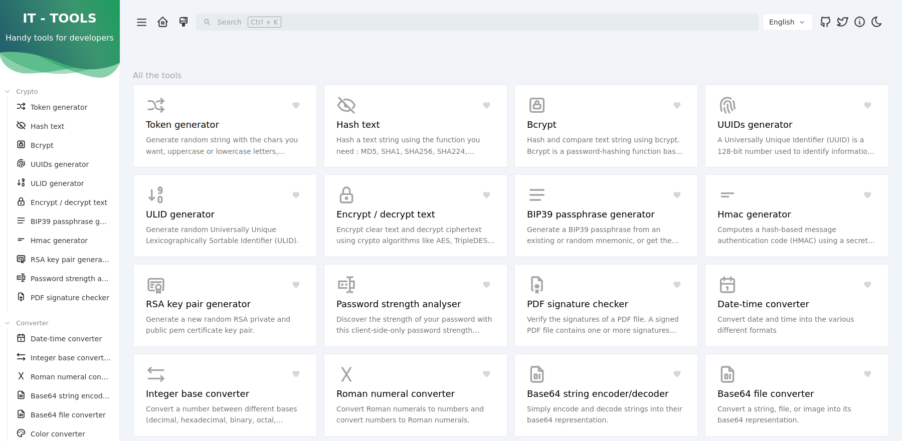

<!--
NOTA: Este README foi creado automáticamente por <https://github.com/YunoHost/apps/tree/master/tools/readme_generator>
NON debe editarse manualmente.
-->

# IT Tools para YunoHost

[](https://ci-apps.yunohost.org/ci/apps/it-tools/)  

[](https://install-app.yunohost.org/?app=it-tools)

*[Le este README en outros idiomas.](./ALL_README.md)*

> *Este paquete permíteche instalar IT Tools de xeito rápido e doado nun servidor YunoHost.*  
> *Se non usas YunoHost, le a [documentación](https://yunohost.org/install) para saber como instalalo.*

## Vista xeral

Useful online tools for developers and people working in IT.

**Versión proporcionada:** 1.0.0~ynh1

**Demo:** <https://it-tools.tech>

## Capturas de pantalla



## Documentación e recursos

- Repositorio de orixe do código: <https://github.com/CorentinTh/it-tools>
- Tenda YunoHost: <https://apps.yunohost.org/app/it-tools>
- Informar dun problema: <https://github.com/YunoHost-Apps/it-tools_ynh/issues>

## Info de desenvolvemento

Envía a túa colaboración á [rama `testing`](https://github.com/YunoHost-Apps/it-tools_ynh/tree/testing).

Para probar a rama `testing`, procede deste xeito:

```bash
sudo yunohost app install https://github.com/YunoHost-Apps/it-tools_ynh/tree/testing --debug
ou
sudo yunohost app upgrade it-tools -u https://github.com/YunoHost-Apps/it-tools_ynh/tree/testing --debug
```

**Máis info sobre o empaquetado da app:** <https://yunohost.org/packaging_apps>
